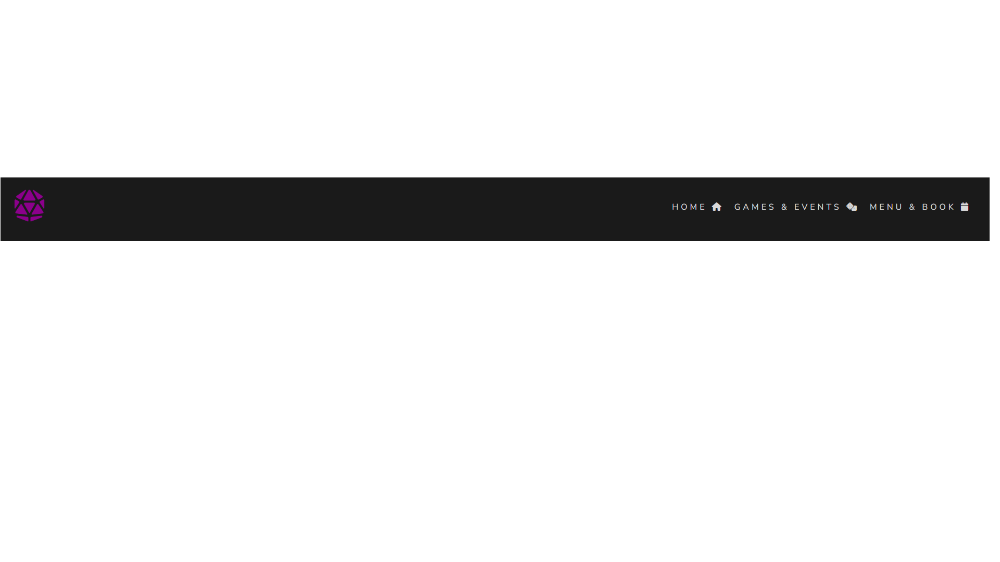
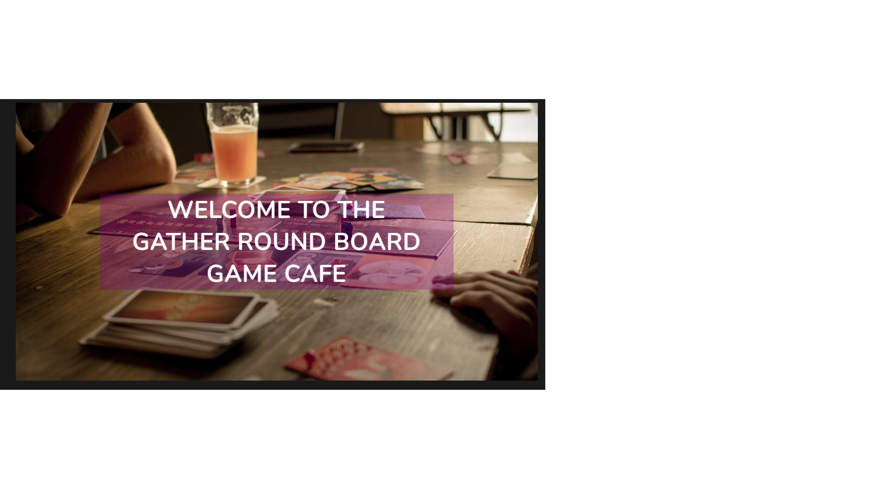
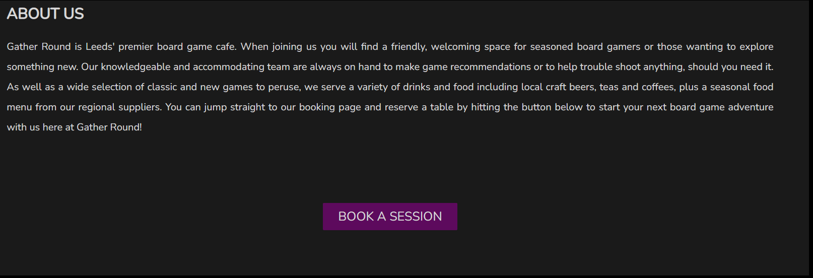
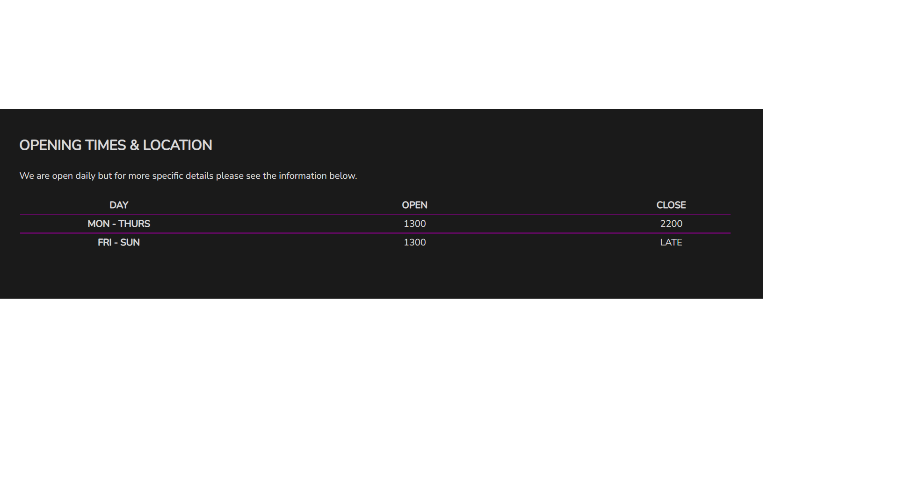
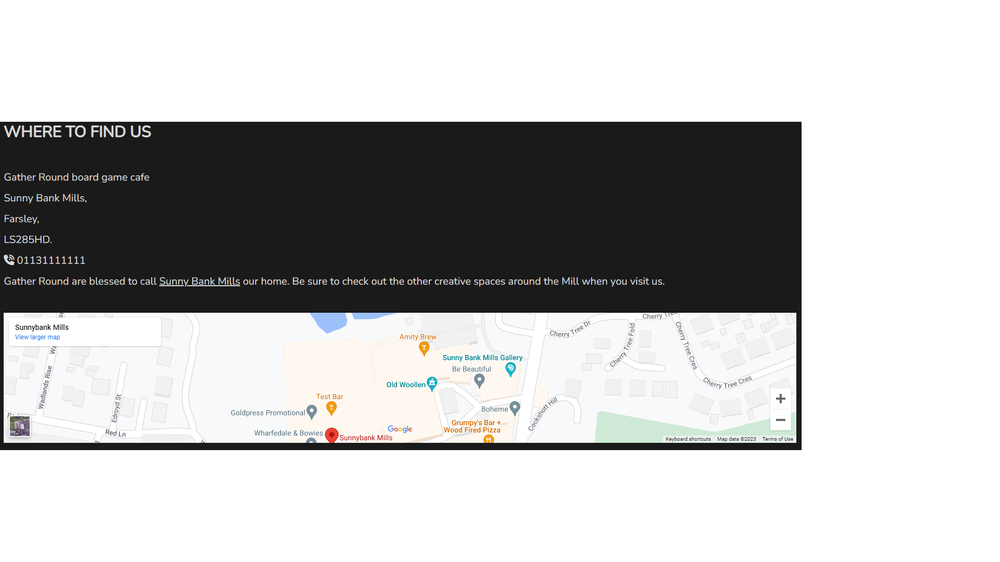
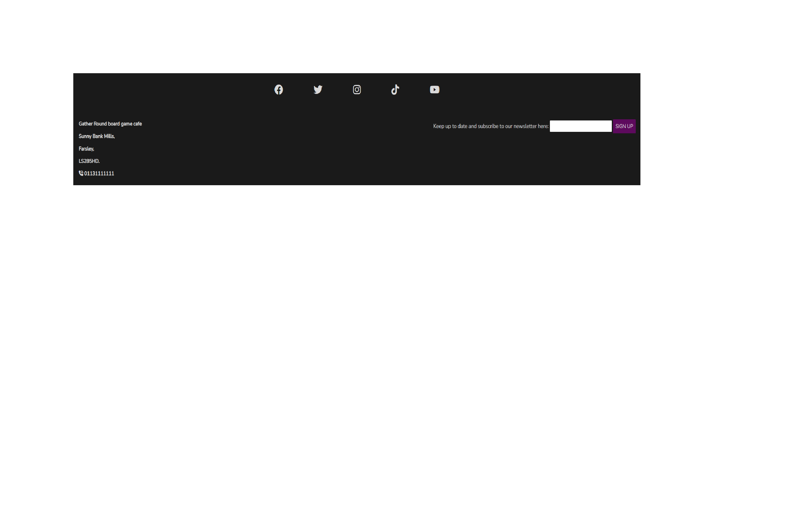
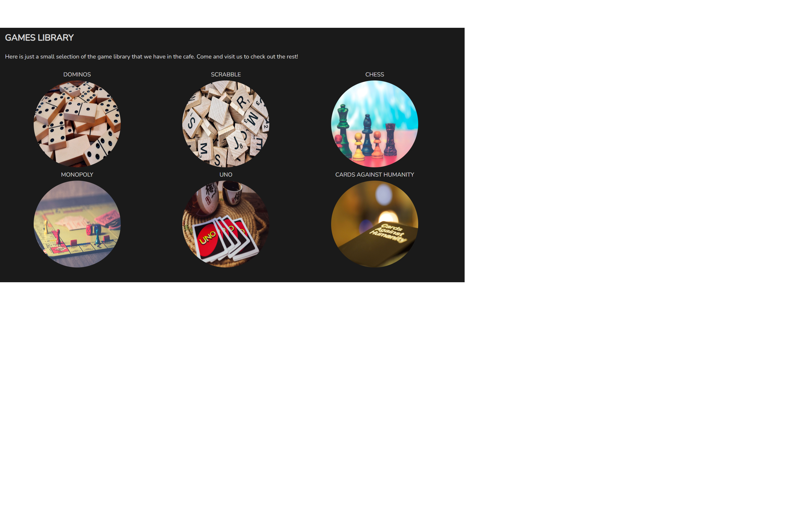
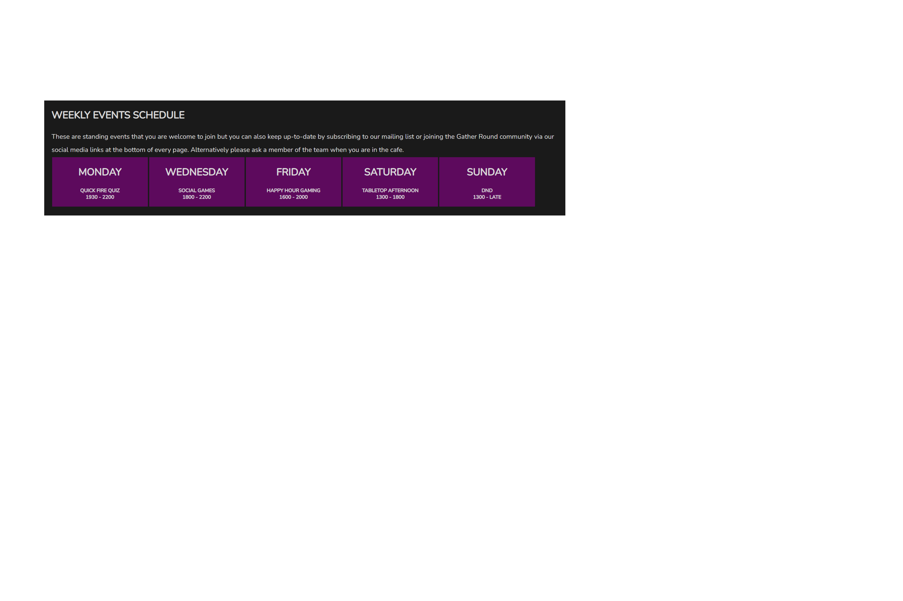

# Gather Round Board Game Website

[View the live project here](https://mattuw4.github.io/Gather-Round-Board-Game-Cafe/)

Gather Round is a fictional website for a fictional boardgame cafe business based in Leeds, UK. The primary focus of the business to to cater for board game enthusiasts and those interested in the hobby in a social environment. The target user for the business are both existing gamers and those interested in trying out a new experience, as well as people wanting to socialise. The primary Unique Selling Point (USP) of the business is that is provides a physical space for people to come together and effectively hire games from the library in the cafe, whilst providing ancillary offers of food and drinks to accompany. The site has been developed to raise awareness of the cafe game, food and drinks offers, whilst providing information on opening times, location, a calendar of events and overview of games offered. There are also means for potential patrons to book a session - a prime focus of the user experience (UX) - or to access more infommation by signing up to a mailing list that will grow the customer base remotely.

## User Experience(UX)

- ### User Stories
    - #### First Time Visitor
    1. I want to easily understand the website purpose and access information on board gaming and the board game cafe.
    2. I want to access information on opening hours, location and find out how to visit.
    3. I want to be able to navigate through a game library and events calendar to understand what is on offer.
    4. I want to browse a food and drinks menu.
- #### Returning vistor
    1. I want achieve the above goals more quickly, fluidly and intuitively.
    2. I want to be able to make a booking, sign up to the mailing list or get in contact with the cafe.
- #### Frequent visitor
    1. I want to be able to go straight the booking page and book a session. 

## Existing site features

The site has been designed to work through the anticipated ranking of need and desires of users from first time visitors to regular users, recognising needs and wants differ.

- F01 Navigation bar

The navigation bar is consistent across all pages, being easy to recognise, find and use. It has a logo to the left that takes the user to the homepage and a simple menu, game library and booking link to the right. The latter have been developed to be responsive for smaller devices with the home page tabe disappearing to accommodate a balanced display.

- F02, F03, F04, F05, F06 Landing page and hero image

There is a hero image on the landing page that welcomes the user and clearly states the cafe name. The image has been chosen to draw the user in to a shared experience that they might be seeking and identify with. There is easily accessible information on the cafe, the opening times (in a table) and location with an embeded google maps link. A button internally links the user directly to the booking page as the site intends to provide information to make an informed decision, that decision being for a user to commit their custom and book.

- F07 Landing page and hero image

The footer is consistent across all pages, being easy to recognise, find and use. It has the address and contact details to the left. Centrally there are the main social media platforms that will link the user to Gather Round's social media platforms, these all opening in a new window. To the right there is an option for the user to enter their email to join the mailing list for both further information but to also curate an UX of being part of a community and connecting with other like-minded people. The form prompts the user to enter an email in order to submit the form.

- F08, F09 Games and Events page

This page provides an overview of some games that the cafe offers. The images are styled to draw the user in whilst providing easily accessible information for them to make a decision. These image columns are responsively styled on smaller devices. There is a booking button again that encourages the user to book based on the games that they have seen and make this easy to achieve. The events section is also responsively designed to scale to fit smaller devices. The intention of this section is to again inform the user about what is going on, empowering them to make a decision about joining the social element of the cafe whilst also informing about particular game formats that they may be interested or engaged in.

- F10, F11, F12 Booking and menu hero image, booking form and menu table

The hero image here has been chosen to evoke the social experience that would excite the user and encourage them to book  making an emotional connection. The form has been developed and is a destination from acros the site by internal links. The form requires the user to enter information in all sections but also provides the option to reset at any point. This form is responsively designed to scale down to smaller devices. To accompany the booking form and increase likelihood of a user committing to a longer period of time at the cafe the simple food and drinks menu is below which is also responsively designed. Whilst this information is important it is prioritised lowest in terms of feature prominence because it is anticipated that users would want higher ranking information in the first instance i.e. opening times, locaction, booking options, games and events. 

