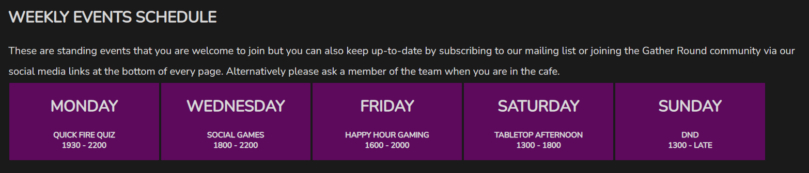
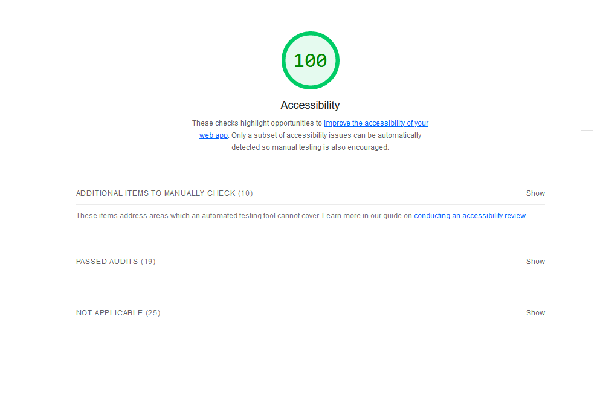
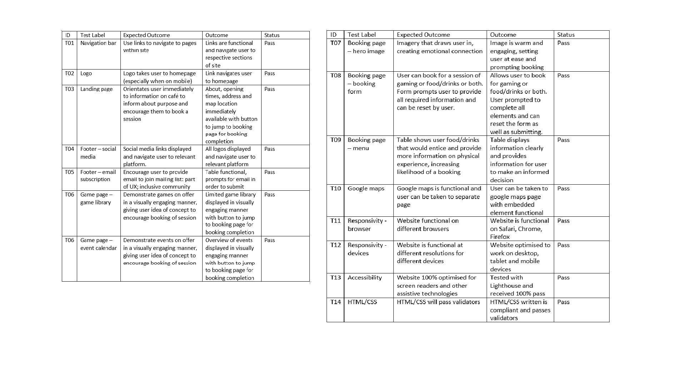

# Gather Round Board Game Website

[View the live project here](https://mattuw4.github.io/Gather-Round-Board-Game-Cafe/)

## Project overview

Gather Round is a fictional website for a fictional board game cafe business based in Leeds, UK. The primary focus of the business to cater for board game enthusiasts and those interested in the hobby in a social environment. The target user for the business are both existing gamers and those interested in trying out a new experience, as well as people wanting to socialise. The primary Unique Selling Point (USP) of the business is that is provides a physical space for people to come together and effectively hire games from the library in the cafe, whilst providing ancillary offers of food and drinks to accompany. The site has been developed to raise awareness of the cafe game, food and drinks offers, whilst providing information on opening times, location, a calendar of events and overview of games offered. There are also means for potential patrons to book a session - a prime focus of the user experience (UX) - or to access more information by signing up to a mailing list that will grow the customer base remotely. The site is designed to be simple, yet engaging for UX in order that visitors can access relevant information in order to be able to make a decision. The content is rich but foxused and contextualised in a stylised world that the user would be able to understand and identify with.

## User Experience(UX)

- ### User Stories
  
- #### First Time Visitor
  
    1. I want to easily understand the website purpose and access information on board gaming and the board game cafe.
    2. I want to access information on opening hours, location and find out how to visit.
    3. I want to be able to navigate through a game library and events calendar to understand what is on offer.
    4. I want to browse a food and drinks menu.

- #### Returning Visitor
  
    1. I want achieve the above goals more quickly, fluidly and intuitively.
    2. I want to be able to make a booking, sign up to the mailing list or get in contact with the cafe.

- #### Frequent Visitor
  
    1. I want to be able to go straight the booking page and book a session.

## Existing site features

- F01 Navigation bar

The navigation bar is consistent across all pages, being easy to recognise, find and use. It has a logo to the left that takes the user to the homepage and a simple menu, game library and booking link to the right. The latter have been developed to be responsive for smaller devices with the home page tab disappearing to accommodate a balanced display.

- F02, F03, F04, F05, F06 Landing page and hero image

There is a hero image on the landing page that welcomes the user and clearly states the cafe name. The image has been chosen to draw the user in to a shared experience that they might be seeking and identify with. It is styled with CSS to slowly zoom in and out as a feature that would engage the user and provide depth to the page. There is easily accessible information on the cafe, the opening times (in a table) and location with an embedded google maps link. A button internally links the user directly to the booking page as the site intends to provide information to make an informed decision, that decision being for a user to commit their custom and book.

- F07 Footer, Social Media Links and Newsletter Subscribe option

The footer is consistent across all pages, being easy to recognise, find and use. It has the address and contact details to the left. Centrally there are the main social media platforms that will link the user to Gather Round's social media platforms, these all opening in a new window. To the right there is an option for the user to enter their email to join the mailing list for both further information but to also curate an UX of being part of a community and connecting with other like-minded people. The form prompts the user to enter an email in order to submit the form. The footer is responsive to smaller device sizes using grid functions.

- F08, F09 Games and Events page

This page provides an overview of some games that the cafe offers. The images are styled to draw the user in whilst providing easily accessible information for them to make a decision. These image columns are responsively styled on smaller devices. There is a booking button again that encourages the user to book based on the games that they have seen and make this easy to achieve. The events section is also responsively designed to scale to fit smaller devices. The intention of this section is to again inform the user about what is going on, empowering them to make a decision about joining the social element of the cafe whilst also informing about particular game formats that they may be interested or engaged in. The event calendar has been styled to engage the user and provide a visually pleasing experience. The page is responsive to smaller device sizes using columns and grid css functions.

- F10, F11, F12 Booking and menu hero image, booking form and menu table

The hero image here has been chosen to evoke the social experience that would excite the user and encourage them to book  making an emotional connection. The form has been developed and is a destination from across the site by internal links. The form requires the user to enter information in all sections but also provides the option to reset at any point. This form is responsively designed to scale down to smaller devices. To accompany the booking form and increase likelihood of a user committing to a longer period of time at the cafe the simple food and drinks menu is below which is also responsively designed. Whilst this information is important it is prioritised lowest in terms of feature prominence because it is anticipated that users would want higher ranking information in the first instance i.e. opening times, location, booking options, games and events. The form is fully styled to be responsive to smaller device screen sizes, as is the table.

## User story interaction with features

The site has been designed to work through the anticipated ranking of need and desires of users from first time visitors to regular users, recognising needs and wants differ. The design and priority of features is intended to provide the information that users would require to make a connection to the brand and experience of the cafe e.g. imagery that evokes emotion is used prominently to draw in new users and for existing to continue to identify as a collective but this is not laid out to obscure access to higher ranking information around location, opening times etc. or the ability to book. The flow through the site is intended to bring new and developing users through to the booking page whilst still providing intuitive access to recurrent user needs around events or the food or drink menu. The buttons are styled with hover features to draw attention of the user and provide feedback during use.

## Features for future consideration and development

- It could be explored to develop an online e-commerce/shop element of the site to develop the offer and build the prominence of the cafe virtually.
- Sections for more UX reflection could easily be included e.g. testimonials, pictures, suggestions box. This would develop the community sense and emotional connection to the brand and likelihood of a user committing and remaining so.
- A scrolling nav bar could be implemented to allow for easier navigation when further exploring the site or, a 'return to the top' function.

## Design

### Imagery & Icons

As stated, the images and iconography are styled and employed to connect with users who are existing gamers (e.g. dice 10 for home icon as this is associated with board gamers) or to make orientation quicker and so facilitate access and engagement e.g. small images next to navigation tabs. The hero images were selected to evoke emotional responses from users, providing a sense of connection and belonging for regular visitors or, something that is relatable and accessible for new.

### Colours and scheme

Consistent colours of white, black and purple were employed to make the site more accessible visually and aid with elements being prominent. These colours would also relate to the branding of the cafe itself. The darker shades of black/purple were selected to create a complimentary, warm ambience. With the contrasting colour and imagery usage it has not been necessary to use other structural elements to establish different sections but this is something that could be explored further in future development.

## Wireframe sketches

### Landing page

### Games & Events

### Booking & Menu

## Technology employed

### Development languages

- [HTML5](https://en.wikipedia.org/wiki/HTML5)
- [CSS3](https://en.wikipedia.org/wiki/HTML5)

### Libraries, frameworks and programs

- [Pexels](https://www.pexels.com/): this was used to access images for the site
- [Font Awesome](https://fontawesome.com/): this was used to access icons for design purposes.
- [Google Fonts](https://fonts.google.com/): Nunito font was downloaded and imported to be applied across the project for styling purposes.
- [Code Anywhere](https://codeanywhere.com/): this was used for version control via the terminal to commit to Code Anywhere and Push to GitHub as the repository.
- [GItHub](https://github.com/): this was used as a repository for projects that were committed from Code Anywhere.
- [Tiny PNG](https://tinypng.com/): this was used to compress files for inclusion.

- The site has been tested in [HTML Validator](https://validator.w3.org/). The HTML is valid at the time of writing as demonstrated below:

There were a number of errors relating to syntax issues and incorrect use of aria-labelby identified which were fixed by the developer.

- The site has been tested in [CSS Validator](https://jigsaw.w3.org/css-validator/). The CSS is valid at the time of writing as demonstrated below:

There were a number of errors relating to syntax issues that were fixed by the developer.

## Lighthouse accessibility test

[Google's web.dev page quality test](https://web.dev/measure/) was used to measure the website against performance, accessibility, SEO and best practice.

### Performance

As the performance score is lower than desired the following steps are some of the approaches that could be considered to address this in the future:

- reduce weight of pages;
- increase speed of servers;
- or better render blocking resources.

### Accessibility

- Before the accessibility test the site was rated around 84 as there were some syntax issues and aria-labelby had been used incorrectly but by addressing these elements a 100% rating has been achieved.

### SEO

### Best Practice

## Browser compatibility and responsivity

The site has been tested on the following browsers with no issues identified at the time of testing:

- Firefox 113.0.2 (64 bit)
- Edge 113.0. 1774.35 (64 bit)
- Chrome 113.0. 5672.64 (64 bit)
- Safari 16.4.1

The site has been developed to be responsive at:

- larger to medium screen sizes from 1200px wide and down;
- medium to smaller screen sizes from 950px wide and down;
- and smaller screen sizes from 375px wide and down.

## Scenario testing and results

The following details the tests that were set out and completed for the site:

The site has been developed to be responsive on:

- larger to medium screen sizes from 1200px wide and down;
- medium to smaller screen sizes from 950px wide and down;
- and smaller screen sizes from 320px wide and down.
  
## Known bugs

- Within Code Anywhere there is a warning notification of "Import statements do not load in parallel". This has been explored with support and is understood to relate to potential perforaance issues if there were a style sheet opened or linked to the style sheet within this project. As this is not a feature of this project, the warning is not thought to be significant at this time.
- It was noted that the game images did not align within the columns after testing and adapting the CSS. This was due to a style rule being applied globally to paragraphs. A solution to apply a local rule to the paragraph of the div was implemented without using fixes like flex or display grid as the stated approach achieved the desired outcome.

## Deployment

### Deployment of site

- In the GitHub repository, select the Settings tab;
- Select the Pages tab from the left hand menu;
- Under the branch section select 'main' branch. This will display a message to indicate deployment if completed successfully;
- Any subsequent changes to the project will take effect on the live page;
- A live link to the functional site can be found here [View the live project here](https://mattuw4.github.io/Gather-Round-Board-Game-Cafe/).

### Cloning the repository

- Navigate to the repository <https://github.com/MattuW4/Gather-Round-Board-Game-Cafe> on GitHub;
- Above the list of files, click Code;
- Copy the URL for the repository by selecting HTTPs;
- Open Git Bash;
- Change the current working directory to the location where you want the cloned directory;
- Type 'git clone', and then paste the URL you copied earlier;
- Press Enter to create your local clone.

### Forking a project

- A fork is a new repository that shares code and visibility settings with the original “upstream” repository.
- On GitHub.com, navigate to the relevant repository;
- In the top-right corner of the page, click Fork;
- Under "Owner," select the dropdown menu and click an owner for the forked repository;
- By default, forks are named the same as their upstream repositories. Optionally, to further distinguish your fork, in the "Repository name" field, type a name;
- Optionally, in the "Description" field, type a description of your fork;
- Optionally, select Copy the DEFAULT branch only;
- For many forking scenarios, such as contributing to open-source projects, you only need to copy the default branch. If you do not select this option, all branches will be copied into the new fork;
- Click Create fork.

### Any change made to the site should be committed and pushed to GitHub like so within your IDE terminal

- Using the 'Git Add' command move files to the staging area;
- Using the 'Git Commit' command take a snapshot of the current state of your repository;
- The git commit command requires a commit message that describes the snapshot/changes that you made in that commit;
- Use the 'Git Push' command to push the files to the GitHub repository;
- As the site is live changes will take effect there.

## Credits

### Content

- All content was written by the developer.

### Code

Within the CSS code there are comments to indicate where the below resources were used as a basis to inform the code that was ultimately produced to style the site.

- Code on how to use flex box and implement for ordering purposes was informed by resources from [CSS Tricks](https://css-tricks.com/snippets/css/a-guide-to-flexbox/).
- Code to style and make the events calendar and tables in the site responsive was informed by the Code Institute [Love Running Project](https://learn.codeinstitute.net/courses/course-v1:CodeInstitute+LR101+2021_T1/courseware/4a07c57382724cfda5834497317f24d5/c428cfb8fd5e4852bbba1f94e914b3b4/).
- Code on how to develop a hero image background with CSS was informed by resources from [W3SCHOOLS](https://www.w3schools.com/howto/howto_css_hero_image.asp).
- Code on how to style the hover function and pointer with CSS was informed by resources from [W3SCHOOLS](https://www.w3schools.com/cssref/sel_hover.php).
- Code on how to style the zoom feature of the landing page hero image when hovering with CSS was informed by resources from [CODEPEN](https://codepen.io/jnnfrcyl/pen/rpQNOB).
- Code on how to apply a gradient color style using css was informed by resources from [W3SCHOOLS](https://www.w3schools.com/css/css3_gradients.asp).

### Media

- The icons used in the nav bar and footer were taken from [Font Awesome](https://fontawesome.com/)
- The font used across the site was taken from [Google Fonts](https://fonts.google.com/)
- All images from accessed from [Pexels](https://www.pexels.com/):
  - [The Home Page Hero Image](https://www.pexels.com/photo/close-up-of-people-playing-board-game-4967339/) was by Egidijus Bielskis.
  - [The Booking Page Hero Image](https://www.pexels.com/photo/group-of-people-sitting-at-the-table-8111298/) was by Pavel Danilyuk.
  - [The Domino Image](https://www.pexels.com/photo/addiction-deck-dominoes-gambling-278912/) was by Pixabay.
  - [The Scrabble Image](https://www.pexels.com/photo/addiction-deck-dominoes-gambling-278912/) was by Pixabay.
  - [The Chess image](https://www.pexels.com/photo/chess-pieces-on-table-1152662/) was by Ylanite Koppens.
  - [The Monopoly image](https://www.pexels.com/photo/chess-pieces-on-table-1152662/) was by Ylanite Koppens.
  - [The Uno image](https://www.pexels.com/photo/teapot-and-teacup-beside-uno-cards-on-round-woven-placemat-15111350/) was by Arturo David A.
  - [The Cards Against Humanity image](https://www.pexels.com/photo/cards-against-humanity-188470/) was by Pablo Punk.

## Acknowledgements

Thanks to my mentor Brian Macharia who provided insightful feedback, reassurance and input with the project development and implementation.
